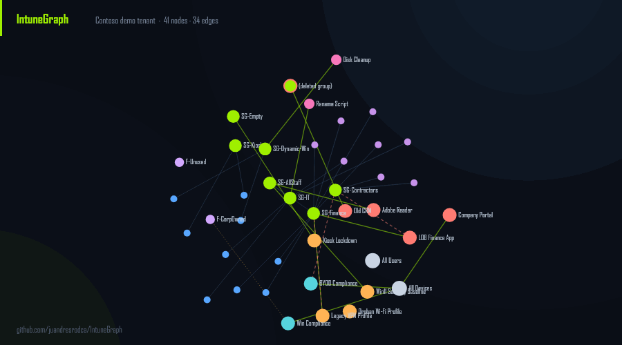

# IntuneGraph

**Turn your Microsoft Intune tenant into an interactive relationship graph.** See what actually applies to a device and *why*, preview the blast radius before you touch a group, and find the orphaned junk, all from a local, read-only snapshot.

[](#requirements)
[](LICENSE)
[](docs/permissions.md)
[](docs/mcp.md)
[](tests/)

>  Intune assignments *are* a graph , groups nest, filters narrow,   includes and excludes fight. But every existing tool shows you flat lists. IntuneGraph makes the graph the data model, so the questions admins actually ask become simple queries.

---
Demo:
https://juandresrodca.github.io/IntuneGraph/demo/
---

## Try it in 30  seconds, no tenant needed


```powershell
Install-Module IntuneGraph -Scope CurrentUser      # (coming to PSGallery)
Import-Module IntuneGraph
Export-IntuneGraph -DemoData -PassThru | Show-IntuneGraph -Open
```

That builds the bundled **Contoso** demo tenant and opens   the interactive graph in your browser — zero Graph auth, zero setup. The whole tool works offline against demo data, which means you can evaluate it (and contribute to it) without ever touching a real tenant.



---

## New: ask your AI *why* a policy applies — and get the group path, not a guess

IntuneGraph ships an **MCP server**, so Claude Code or GitHub Copilot can query the
graph directly:

```bash
claude mcp add intunegraph -- pwsh -NoLogo -NoProfile -NonInteractive \
  -File ./tools/mcp/mcp-server.ps1 -Path ./graph.json
```

```
> why does Win11 Security Baseline apply to DEV-FIN-01?

  [intune_target]
  Win11 Security Baseline  ConfigPolicy  Applies
  via  DEV-FIN-01 -> SG-Finance -> SG-AllStaff

> what happens if I add KIOSK-01 to SG-Finance?

  [intune_blast_radius]
  Gains 3 workload(s), loses 0.
   + LOB Finance App (required)
   + Win11 Security Baseline
   + Adobe Reader (available)
```

Other Intune MCP servers wrap Graph endpoints — they can *list* policies. None can
answer **why** one applies, because none of them model group nesting, filters and
include/exclude collisions. This one does, because that's the whole data model.

**And it never touches your tenant.** The server reads a local `graph.json` snapshot,
so the assistant gets the answers without ever getting your credentials. You decide
when to refresh it. Six read-only tools: `intune_target`, `intune_blast_radius`,
`intune_orphans`, `intune_path`, `intune_node`, `intune_summary` — see
[docs/mcp.md](docs/mcp.md).

---

## The three questions it answers

### 1. "What applies to this device, and *why*?"  →  ` Get-IntuneTarget `

```
PS> Get-IntuneTarget -Identity DEV-FIN-01

Workload                Type             Status           Intent    Via
--------                ----             ---------        - -  ------    ---
Adobe Reader            App              Applies          available DEV-FIN-01 -> SG-Finance -> SG-AllStaff
Company Portal          App              Applies          required  DEV-FIN-01 -> All Devices
LOB Finance App         App              Applies          required  DEV-FIN-01 -> SG-Finance
Win Compliance          CompliancePolicy AppliesPreFilter           DEV-FIN-01 -> All Devices          (F-CorpOwned)
Win11 Security Baseline ConfigPolicy     Applies                    DEV-FIN-01 -> SG-Finance -> SG-AllStaff
```

The **`Via`** column. The exact group path that causes each assignment, through nesting — is what flat-list tools don't give you. Add `-IncludeExcluded` to see what's blocked by an exclusion and why.

### 2. "What breaks if I touch this group?"  →  `Get-IntuneBlastRadius`

```
PS> Get-IntuneBlastRadius -Group SG-Finance -WhatIfAddMember KIOSK-01

Adding 'KIOSK-01' to 'SG-Finance':
  Gains 3 workload(s), loses 0.
```

Preview the impact of a membership change **before** you make it: exactly which policies, apps and scripts a device or user gains or loses, resolved through nesting and exclusions.

### 3. "What's assigned to nothing / broken?"  →  `Find-IntuneOrphan`

```
PS> Find-IntuneOrphan

Check                   Severity NodeName
-----                   -------- --------
BrokenGroupReference    High     Old CRM                (targets a deleted group)
IncludeExcludeCollision High     Legacy VPN Profile     (same group included and excluded)
EmptyTarget             Warning  Kiosk Lockdown         (assigned only to an empty group)
MixedTargeting          Warning  BYOD Compliance        (device policy excludes a user group - does nothing)
Unassigned              Info     Orphan Wi-Fi Profile   (no assignments)
UnusedFilter            Info     F-Unused               (referenced by nothing)
```

---

## Quick start against your tenant

```powershell
Connect-IntuneGraph                    # least-privilege, read-only consent
Export-IntuneGraph -Html -PassThru | Show-IntuneGraph -Open
Get-IntuneTarget    -Identity <deviceName|UPN|GUID>
Get-IntuneBlastRadius -Group <groupName>
Find-IntuneOrphan
```

`Export-IntuneGraph` is the only command that talks to Graph. It writes a `graph.json` snapshot; every query runs against that snapshot — fast, offline, and reproducible.

## Permissions & security

IntuneGraph requests **four read-only scopes and zero write scopes**, and the code contains **no `POST`/`PATCH`/`DELETE` paths** — the single function that calls Graph hardcodes `GET`.

| Scope | Why |
|---|---|
| `DeviceManagementConfiguration.Read.All` | config/compliance policies, scripts, filters |
| `DeviceManagementApps.Read.All` | apps + assignments |
| `DeviceManagementManagedDevices.Read.All` | managed devices |
| `Group.Read.All` | groups + membership |

No telemetry. The HTML report makes **zero network calls** (the renderer is vendored inline). Your data never leaves the `graph.json` you exported. See [docs/permissions.md](docs/permissions.md).

Found a security problem? Please report it privately — the process, the supported versions and the guarantees this project treats as invariants are in [SECURITY.md](SECURITY.md).

## How it stacks up

IntuneGraph is  deliberately *not*  another  config-backup tool — it's the relationship-and-impact layer. The excellent tools below solve adjacent problems; use them together.

| | IntuneGraph | [IntuneAssignmentChecker](https://github.com/ugurkocde/IntuneAssignmentChecker) | [IntuneCD](https://github.com/almenscorner/IntuneCD) | Intune portal |
|---|:--:|:--:|:--:|:--:|
| "What applies to X" as a list | ✅ | ✅ | – | ✅ |
| **Membership path** ("via" / why) | ✅ | – | – | – |
| **Blast-radius / change impact** | ✅ | – | – | – |
| **Assignment hygiene checks** | ✅ | partial | – | – |
| **Interactive graph visualization** | ✅ | – | – | – |
| **MCP server (ask an AI, offline)** | ✅ | – | – | – |
| Config backup / config-as-code | – | – | ✅ | – |

## Requirements

- **PowerShell 7+** recommended; ** Windows PowerShell 5.1 ** supported.
- `Microsoft.Graph.Authentication` (only for live tenant use; loaded on demand). Demo mode needs nothing.

## Contributing

Every test runs on fixtures — **no tenant needed to contribute**. `.\build.ps1 -Task Test`. [CONTRIBUTING.md](CONTRIBUTING.md) covers the layout, the build tasks, the PSScriptAnalyzer settings and the guarantees a change must not break; see [docs/fixtures.md](docs/fixtures.md) for how the demo tenant is structured and how to add a scenario.

Decisions that are easy to undo by accident are written down rather than remembered — [docs/permissions.md](docs/permissions.md) for the read-only scope guarantees, [docs/discoverability.md](docs/discoverability.md) for what the repository's topics and description are meant to do.


## License

MIT. Not affiliated with Microsoft. IntuneGraph is a read-only reporting tool — always verify changes in the Intune portal.
