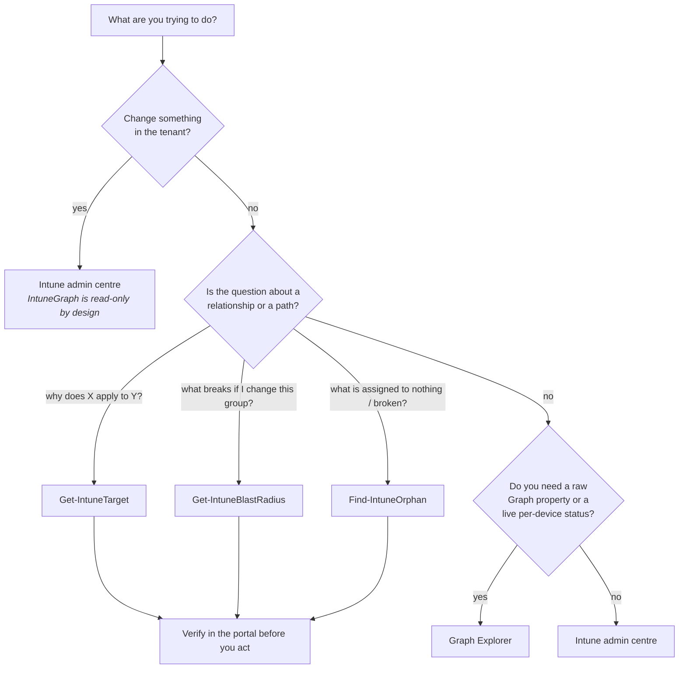

# Choosing the right tool: IntuneGraph, Graph Explorer and the Intune admin centre

IntuneGraph is not a replacement for the Intune admin centre, and it is not a nicer
Graph Explorer. It answers a different class of question — *relationship* questions —
and it answers them against a local snapshot rather than a live tenant.

This guide is for an Intune administrator deciding which of the three to open, not for
a Graph API expert. If you only read one section, read
[the decision table](#the-decision-table) and
[what IntuneGraph will not tell you](#what-intunegraph-will-not-tell-you).

---

## The decision table

| You want to… | IntuneGraph | Graph Explorer | Intune admin centre |
|---|:--:|:--:|:--:|
| List policies, apps, scripts and filters | ✅ | ✅ | ✅ |
| See a policy's assignment list | ✅ | ✅ | ✅ |
| Answer **"why does this apply to this device?"** with the group path | ✅ | – | – |
| Resolve **nested** group membership through several levels | ✅ | manual | – |
| See which **exclusion** beat which include, and where it came from | ✅ | manual | – |
| Preview **what a membership change would do** before making it | ✅ | – | – |
| Find orphaned, broken or self-cancelling assignments in one pass | ✅ | – | – |
| Read a raw property the UI does not surface | – | ✅ | – |
| Explore an endpoint you have never called before | – | ✅ | – |
| **Change** anything | – | ✅ | ✅ |
| See a device's real compliance and check-in state | – | ✅ | ✅ |
| See whether a policy actually landed on a device | – | ✅ | ✅ |
| Work offline, on a plane, with no tenant | ✅ | – | – |
| Hand a colleague a self-contained artefact | ✅ | – | – |
| Run it unattended in a pipeline | ✅ | – | – |

The pattern: **the portal and Graph Explorer are authoritative about state, IntuneGraph
is authoritative about structure.** Anything you are about to click on belongs in the
portal. Anything shaped like *"…and why?"* belongs here.

---

## Decision tree



---

## Workflow examples

### 1. Troubleshooting "this policy should not be here"

A user reports that a kiosk machine picked up the finance baseline. The portal shows
you the policy's assignments; it does not show you why *this* device matched one.

```powershell
Export-IntuneGraph -PassThru | Out-Null      # refresh the snapshot
Get-IntuneTarget -Identity KIOSK-01 -IncludeExcluded
```

```
Workload                Type             Status           Intent   Via
--------                ----             ------           ------   ---
Win11 Security Baseline ConfigPolicy     Applies                   KIOSK-01 -> SG-Kiosks -> SG-AllStaff
Legacy VPN Profile      ConfigPolicy     Excluded                  KIOSK-01 -> SG-Kiosks
```

The `Via` column is the answer: `SG-Kiosks` is nested inside `SG-AllStaff`, and the
baseline targets the parent. Nothing in the portal shows you that chain — it shows the
baseline targeting `SG-AllStaff` and leaves the nesting for you to reconstruct by hand.

`-IncludeExcluded` is what turns "it does not apply" into "it does not apply *because*
of this exclusion", which is the difference between a fix and a guess.

### 2. Planning a group membership change

Before adding a machine to a group, ask what it gains and loses:

```powershell
Get-IntuneBlastRadius -Group SG-Finance -WhatIfAddMember KIOSK-01
```

```
Adding 'KIOSK-01' to 'SG-Finance':
  Gains 3 workload(s), loses 0.
   + LOB Finance App (required)
   + Win11 Security Baseline
   + Adobe Reader (available)
```

`-WhatIfRemoveMember` answers the other half, which matters more during offboarding and
group consolidation: removing a device from a group can *silently* drop a compliance
policy, and nothing in the portal warns you.

This is the one workflow worth running before every membership change you cannot
trivially undo.

### 3. Quarterly assignment hygiene

```powershell
Find-IntuneOrphan -Severity High
```

```
Check                   Severity NodeName
-----                   -------- --------
BrokenGroupReference    High     Old CRM             (targets a deleted group)
IncludeExcludeCollision High     Legacy VPN Profile  (same group included and excluded)
```

Six checks are available — `Unassigned`, `EmptyTarget`, `IncludeExcludeCollision`,
`BrokenGroupReference`, `UnusedFilter`, `MixedTargeting` — and you can narrow with
`-Check`. `MixedTargeting` is the quiet one: a device-scoped policy excluding a *user*
group does nothing at all, and the portal accepts the configuration without complaint.

### 4. Handing the finding to someone else

```powershell
Export-IntuneGraph -Html -PassThru | Show-IntuneGraph -Focus SG-Finance -Depth 2 -Open
```

`Show-IntuneGraph` writes a single self-contained HTML file with the renderer vendored
inline — no CDN, no network calls — so it survives being attached to a change request
or opened on a machine with no tenant access. `-Focus` and `-Depth` trim the graph to
the neighbourhood you are actually arguing about.

Treat the output like the `graph.json` it came from: it describes your tenant, so it is
sensitive.

---

## IntuneGraph + Graph Explorer

Graph Explorer is where you go when you need a property IntuneGraph deliberately did
not keep. The export is a *model*, not a mirror: it normalises objects into nodes and
edges and drops everything it does not need to answer relationship questions.

These are the endpoints the export reads, so this is where to look in Graph Explorer
when you want the raw object behind a node:

| Node type | Endpoint |
|---|---|
| ConfigPolicy | `/beta/deviceManagement/configurationPolicies`, `/v1.0/deviceManagement/deviceConfigurations` |
| CompliancePolicy | `/v1.0/deviceManagement/deviceCompliancePolicies` |
| App | `/v1.0/deviceAppManagement/mobileApps` |
| Script | `/beta/deviceManagement/deviceManagementScripts`, `/beta/deviceManagement/deviceHealthScripts` |
| Filter | `/beta/deviceManagement/assignmentFilters` |
| Group | `/v1.0/groups`, `/v1.0/groups/{id}/members` |
| Device | `/v1.0/deviceManagement/managedDevices` |

A good division of labour:

- **IntuneGraph finds the object.** `Get-IntuneGraphNode -Type ConfigPolicy -Name '*VPN*'`
  gives you the node and its `SourceId`.
- **Graph Explorer inspects it.** Paste that id into the matching endpoint above to read
  the settings payload, the platform, the `createdDateTime`, or anything else the model
  drops.

Use Graph Explorer, not IntuneGraph, when you are exploring an endpoint you have never
called, when you suspect the model is wrong, or when you need a property to file a bug
against this project.

---

## IntuneGraph + the Intune admin centre

The portal stays the source of truth. IntuneGraph reads a snapshot, so by definition it
can be out of date, and it holds no opinion about whether the tenant *should* look the
way it does.

The habit worth forming:

1. **Ask in IntuneGraph.** Get the path, the blast radius, the orphan list.
2. **Verify in the portal.** Open the policy and the group the `Via` column named.
3. **Change in the portal.** IntuneGraph has no write path — the single function that
   calls Graph hardcodes `GET`.
4. **Re-export.** A snapshot taken before the change still describes the old tenant.

Step 2 is not ceremony. If the snapshot is an hour old and someone edited a dynamic
group rule in the meantime, the `Via` path you are looking at is history.

---

## Performance and refresh cadence

`Export-IntuneGraph` is the only command that talks to Graph. Everything else runs
against the snapshot, offline, at local-file speed — which is why iterating on a
troubleshooting question costs nothing after the first export.

What the export actually costs:

- **Workloads** are a handful of calls, each with `$expand=assignments`.
- **Groups** dominate. Membership is expanded one call per group, so export time scales
  with the number of groups in the tenant, not with the number of devices.
- **Devices** are a single paged call, and `-SkipDevices` removes it. A tenant with tens
  of thousands of managed devices and a few hundred groups exports noticeably faster
  with `-SkipDevices`, at the cost of device-level `Get-IntuneTarget` queries.

Sensible cadence:

| Situation | Refresh |
|---|---|
| Actively troubleshooting one device | Once, at the start |
| Planning a group change | Immediately before `Get-IntuneBlastRadius` |
| Hygiene review | Weekly or monthly, on a schedule |
| Anything you will act on | Re-export first; a stale snapshot is a wrong answer |

For unattended runs, use certificate-based app-only auth with the four read-only
application permissions — see [permissions.md](permissions.md).

---

## What IntuneGraph will not tell you

Being explicit about this is more useful than a longer feature list.

- **Whether an assignment filter matches.** IntuneGraph reports `AppliesPreFilter` when
  an assignment carries a filter, names the filter, and stops. It does not evaluate the
  filter rule against a device's properties. Treat `AppliesPreFilter` as *"reaches this
  device unless the filter says otherwise"* and check the rule in the portal.
- **Whether the policy actually landed.** There is no per-device delivery, success or
  error state in the model. "Applies" is a statement about targeting, not about what the
  device did with it.
- **Compliance state.** Device nodes carry a name, an operating system and an Entra
  device id. Compliance and last check-in stay in the portal and in Graph.
- **Settings-level conflicts.** If two configuration policies both apply and set the
  same setting to different values, IntuneGraph shows you both. Resolving which one wins
  is Intune's job, and it is visible in the per-setting status in the portal.
- **Anything outside the exported surface.** Conditional Access policies, app protection
  (MAM) policies, Autopilot deployment profiles and enrolment restrictions are not read,
  so they cannot appear in a `Via` path even when they are the real reason a device
  behaves the way it does.
- **Anything that changed after the export.** The snapshot has no live connection. This
  is the point — it makes queries fast, offline and reproducible — but it means the
  answer is always as old as the file.
- **Dynamic group rule evaluation.** Membership is read as Entra reports it at export
  time; IntuneGraph does not re-evaluate `membershipRule` against a device.

None of these are on a roadmap to change. IntuneGraph models the assignment graph; the
portal owns state.

---

## Related reading

- [permissions.md](permissions.md) — the four read-only scopes, app-only auth, national clouds
- [mcp.md](mcp.md) — asking the same questions from Claude Code or Copilot
- [fixtures.md](fixtures.md) — the demo tenant, and how to add a scenario
- [discoverability.md](discoverability.md) — what the repository's topics and description are for
